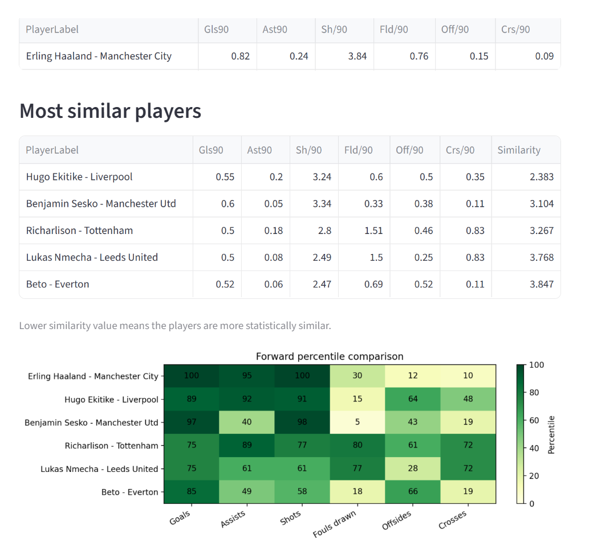

# Football Player Similarity Dashboard

## Overview

The Football Player Similarity Dashboard project aims to identify and group players with similar playing profiles using performance statistics such as goals, shots, assists, crosses and other relevant metrics. The project uses machine learning techniques, specifically K-Means clustering, to analyse player performance data and discover groups of statistically similar players. These insights can help identify comparable players, understand different playing styles, and support football scouting and player analysis.

## Live Deployed Link

[Live Deployed Streamlit App](https://football-player-similarity.streamlit.app/)

## Dashboard Preview



## Features

- **Data Preprocessing:** Merges, cleans and filters football player performance data, including selecting relevant positions and handling missing or inconsistent values.
- **Feature Engineering:** Selects and prepares performance metrics such as goals, assists, shots, fouls drawn, offside and crosses for player comparison.
- **Feature Scaling:** Standardises numerical features to ensure each statistic contributes fairly to the clustering process.
- **Player Similarity:** Uses nearest neighbours and Euclidean distance to rank the most statistically similar players.
- **K-Means Clustering:** Groups players into broad statistical profiles during exploratory analysis.
- **Cluster Visualisation:** Uses dimensionality reduction techniques such as PCA to visualise high dimensional player clusters in two dimensions.
- **Cluster Evaluation:** Assesses clustering quality using techniques such as the Elbow Method and Silhouette Score to help determine an appropriate number of clusters.

## Data Sources

The statistics originate from FBref's 2025/2026 Premier League data:

[FBref Premier League statistics](https://fbref.com/en/comps/9/2025-2026/stats/2025-2026-Premier-League-Stats)

## Installation

1. **Clone the repository and move into the project directory:**

```bash
git clone https://github.com/Galin-GM/football-player-similarity.git
cd football-player-similarity
```

2. **Create and activate a virtual environment, then install the dependencies:**

```bash
python -m venv .venv
python -m pip install -r requirements.txt
```

3. **Run the dashboard**

```bash
python -m streamlit run app.py
```

## Technologies

- Python
- pandas
- scikit-learn
- Matplotlib
- Streamlit
- Jupyter Notebook

## Limitations

- The current model only compares forwards.
- Results depend on the selected features.
- Euclidean distance assumes that every standardised feature has equal importance.
- A statistical match does not necessarily mean two players have identical tactical roles.

## Future Improvements

- Add separate models and feature sets for midfielders, defenders, and goalkeepers.
- Compare players across leagues and seasons.
- Improve dashboard styling.
